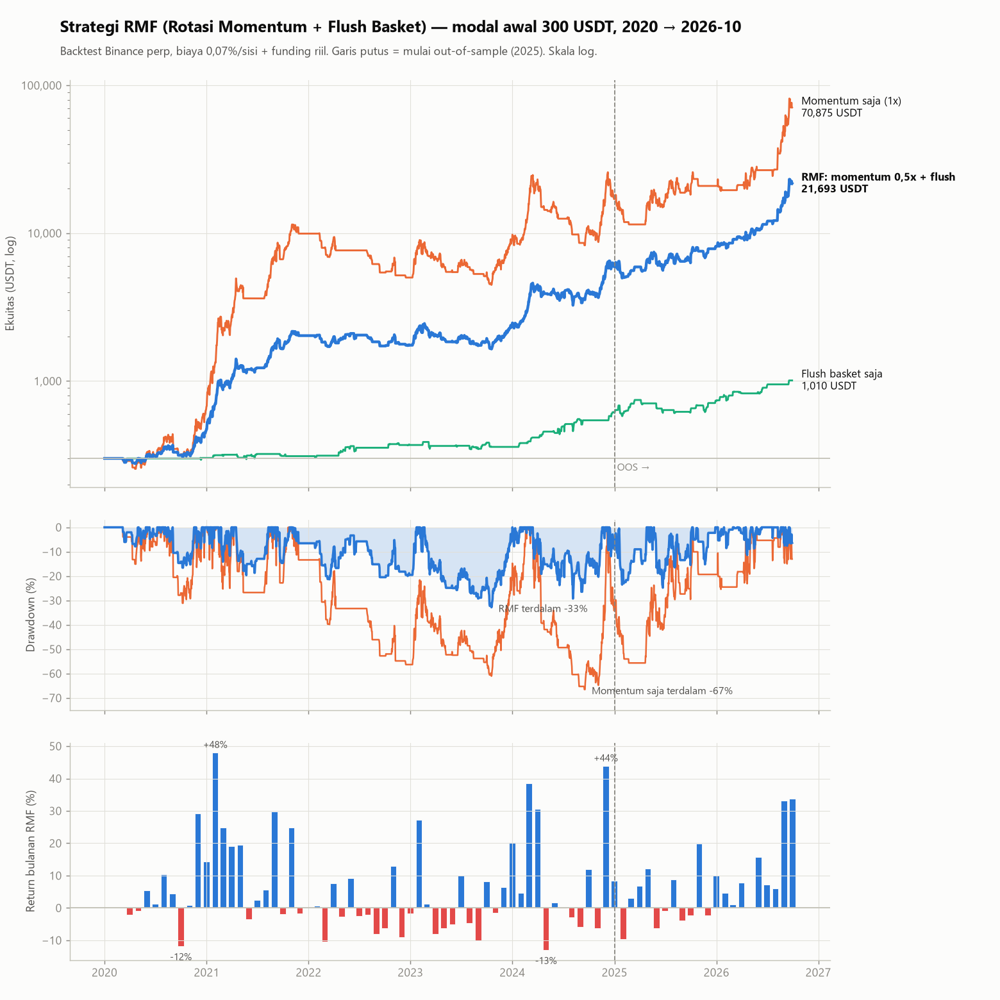

# Strategi RMF — Rotasi Momentum + Flush Basket (data gratis saja)

> **Update 2026-10-04 (versi final):** momentum memakai **10 koin tetap** (bukan "10% teratas", yang di universe sekarang berarti ±15 koin) dan **buffer**: beli kalau peringkat ≤10, jual kalau peringkat >15. Hasil 300 USDT: 21.693 USDT, CAGR 89%, max DD −33%, Sharpe 1,85, ±23 entry momentum per bulan. Report lengkap dan terbaru: `RMF_report.html` (artifact https://claude.ai/artifact/JDNZ4Y3Lo25RTjEAjiHPgH). Angka di bawah ini dari versi awal (10% teratas).

Dibuat 2026-10-04 dari hasil [REPORT_TA_EDGE.md](REPORT_TA_EDGE.md). Simulasi: `research/strategy_sim.py`, grafik: `research/chart_sim.py`.

## Kenapa strategi ini

- Dari 1,29 juta kombinasi indikator, hanya dua edge data-gratis yang lolos IS, OOS, uji t harian, dan cek di HYPE: **momentum lintas koin** dan **flush basket**. Indikator satu-chart (VWAP/SMC/RSI/MA sendirian) tidak lolos.
- Kedua edge ini **hampir tidak berkorelasi** (korelasi mingguan 0,07):
  - Momentum untung saat bull. Ia membeli kekuatan, dan hanya aktif saat BTC > EMA50.
  - Flush membeli kepanikan massal, yang justru sering muncul saat momentum sedang off.
  - Digabung, max DD turun dari −68% ke −36%, dan Sharpe naik dari 1,58 ke 1,89.
- Semua data gratis: candle HYPE (bisa juga Binance) untuk ±150 koin. Tidak perlu OI, funding sebagai sinyal, atau taker volume.

## Aturan (setting untuk modal 300 USDT)

### Sleeve A — Rotasi momentum (TF 1D)

| Item | Aturan |
|---|---|
| Waktu | Setiap hari setelah close candle harian 00:00 UTC (07:00 WIB) |
| Filter rezim | **BTC close harian > EMA50 harian.** Kalau tidak, tutup semua posisi A dan diam di cash |
| Universe | Semua perp yang sudah listing ≥ 60 hari (dan ≥ 44 hari data untuk ranking) |
| Ranking | Return 14 hari (close hari ini ÷ close 14 hari lalu) |
| Entry | Long **10% teratas ≈ 7 koin** (5–8 tergantung jumlah koin), bobot sama, di open harian berikutnya |
| Ukuran | Total notional **0,5× ekuitas**. Dengan 300 USDT, ±150 USDT dibagi 7 koin = **±21 USDT per koin** (di atas minimum order HYPE 10 USDT) |
| Exit / "TP" | **Tidak ada TP tetap.** Koin dijual saat keluar dari 10% teratas di rebalance harian, atau saat filter BTC mati |
| SL | **Tidak ada SL harga di backtest.** Stopnya adalah ranking harian dan filter BTC. Hari terburuk sleeve ini −23% (pada 1×), atau sekitar −11% pada 0,5× |
| Rebalance | Hanya jual yang keluar dan beli yang masuk. Rata-rata turnover ±49% posisi per hari |

### Sleeve B — Flush basket (TF 4H)

| Item | Aturan |
|---|---|
| Waktu | Setiap close candle 4h (00, 04, 08, 12, 16, 20 UTC) |
| Sinyal per koin | Close menembus **kembali ke atas Bollinger bawah (20, 2)** dan **volume > 1,5× SMA20 volume** |
| Syarat basket | **≥ 10 koin** memberi sinyal di bar yang sama |
| Entry | Long semua koin itu (maks **15 koin**, dipilih acak) di open bar berikutnya |
| SL | Entry − **2 × ATR(14, 4h)** (median jarak ±8,5%) |
| TP | Entry + **2 × ATR(14, 4h)** |
| Time stop | 48 bar (8 hari) |
| Risiko | **0,5% ekuitas per koin** (±1,5 USDT), maks **8% per event**. Notional per koin ±18 USDT |

### Leverage & margin

Notional rata-rata gabungan 0,42× ekuitas, puncaknya 3,2× (saat event flush besar bertumpuk dengan momentum). Pakai **isolated ≤ 4×** per koin. Dengan SL 2 ATR, harga likuidasi jauh dari stop.

## Hasil simulasi 300 USDT (Binance perp, biaya 0,07%/sisi + funding riil)

| | Momentum saja (1×) | Flush saja | **RMF (A 0,5× + B)** |
|---|---|---|---|
| Ekuitas akhir (Okt 2026) | 170.165 | 1.010 | **37.886** |
| CAGR | 156% | 20% | **105%** |
| Max drawdown | −68% | −19% | **−36%** |
| Volatilitas tahunan | 78% | 16% | **43%** |
| Sharpe | 1,58 | 1,18 | **1,89** |
| Hari terburuk / bulan terburuk | −23% / −37% | −8% / −7% | **−12% / −13%** |
| Bulan positif | 48% | 40% | **61%** |
| Underwater terlama | 826 hari | 355 hari | **436 hari** |

**RMF per tahun:**

| Tahun | 2020 | 2021 | 2022 | 2023 | 2024 | 2025 | 2026 (s/d Okt) |
|---|---|---|---|---|---|---|---|
| Return | +124% | +462% | −26% | +41% | +197% | +30% | +148% |
| Max DD dalam tahun | −19% | −18% | −30% | −36% | −25% | −25% | −11% |
| Ekuitas akhir tahun (USDT) | 672 | 3.778 | 2.808 | 3.957 | 11.744 | 15.262 | 37.886 |

**Hanya periode OOS** (mulai 300 USDT pada 2025-01-01): menjadi 933 USDT, CAGR 92%, max DD −25%, bulan terburuk −5%, 70% bulan positif.

## Insight

1. **Edge datang dari perbandingan antar koin, bukan dari chart satu koin.** Semua indikator TA klasik pada satu chart gagal mengalahkan entry acak di 15m dan 1h. Yang bekerja adalah "koin mana yang paling kuat dibanding yang lain" (momentum) dan "berapa banyak koin yang panik bersamaan" (breadth).
2. **Filter BTC > EMA50 adalah separuh strategi.** Momentum hanya aktif 56% hari. Di 2022 filter ini menyelamatkan dari sebagian besar crash, tetapi tidak semuanya (−26%).
3. **Return datang bergerombol.** 5 bulan terbaik dari 80 bulan menyumbang ±40% total kenaikan (log). Pola umumnya: berbulan-bulan datar atau turun sedikit, lalu satu-dua bulan +35–60%. Melewatkan bulan seperti itu karena berhenti di tengah drawdown akan merusak hasil.
4. **Flush menang 64% trade**, rata-rata +0,25R, dengan median hold 36 jam. Event-nya makin sering (2024: 26, 2025: 27). Flush paling membantu di 2022 dan 2024–2025, saat momentum sedang lemah.
5. **Lebih sedikit koin lebih baik untuk momentum.** Top 10% (±7 koin) memberi CAGR lebih tinggi dari top 20% (±13 koin) dengan DD hampir sama. Ini kebetulan juga cocok dengan modal kecil.
6. **Biaya terasa.** Turnover momentum ±49%/hari setara ±6%/tahun biaya pada 1×, atau ±3% pada 0,5×. Fee maker lebih murah dari taker, jadi pakai limit order kalau bisa.

## Hal lain yang perlu dipertimbangkan

1. **Ekspektasi live jauh di bawah backtest.**
   - Universe = koin yang masih hidup dan ramai per Sep 2026. Koin yang pump lalu mati tidak ada di data, dan koin yang baru pump otomatis masuk.
   - +37% (Agu) dan +34% (Sep 2026) khususnya patut dicurigai, karena koin itu dipilih justru karena volumenya besar di bulan-bulan itu.
   - Anggap CAGR backtest sebagai **batas atas**. Realistis mungkin setengahnya atau kurang.
   - 2020–2021 (+124% dan +462%) adalah musim alt yang belum tentu terulang.
2. **Drawdown 30–40% dan underwater lebih dari 1 tahun itu normal** untuk strategi ini. Siapkan aturan berhenti sebelum mulai, misalnya hentikan dan evaluasi kalau DD > 45% atau 9 bulan kalah dari "beli semua koin".
3. **Eksekusi di HYPE.**
   - Minimum order 10 USDT. Perhatikan pembulatan `szDecimals`.
   - Likuiditas koin kecil bisa tipis: cek orderbook dan hindari koin dengan volume harian < ±1 juta USDT.
   - Funding HYPE per jam, dan koin momentum sering punya funding positif tinggi. Itu sudah masuk biaya di backtest Binance, tapi HYPE bisa berbeda.
4. **Bentrok dengan MEX 3.0 live.** Jalankan di subaccount terpisah. Kalau koin MEX dan RMF overlap, eksposur total ke satu koin bisa dobel.
5. **Otomasi.**
   - Butuh job harian (ranking 150 koin + filter BTC) dan job 4h (cek flush).
   - API candle HYPE gratis, tapi 150 request per putaran, jadi perhatikan rate limit.
   - Untuk flush perlu ATR 4h dan pemasangan SL/TP langsung saat entry.
6. **Parameter.**
   - L14, top 10%, EMA50, dan ≥10 koin dipilih dari grid. Tetangganya juga positif (128 dari 192 konfigurasi momentum lolos IS t > 2 dan OOS > 0), jadi tidak rapuh.
   - Tetapi stop harga per koin untuk momentum **belum diuji**. Kalau mau dipasang (misalnya −25% sebagai pengaman), uji dulu.
7. **Jalan pelan.** Forward test paper atau ukuran sangat kecil 2–3 bulan dulu. Jangan naikkan momentum ke 1× sebelum ada bukti live: DD 1× bisa −68%.
8. **Belum ada holdout baru yang dipakai.** Kalau ingin validasi tambahan, misalnya data koin yang sudah delisting atau walk-forward, putuskan dulu sebelum dijalankan.
